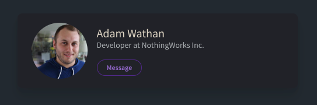

# William Owen UK LIMTED: Reasons not to use a CSS framework

## The Responsive contact card

> “Here's an example of a responsive contact card component built with Tailwind without writing a single line of CSS” - [tailwindcss.com](tailwindcss.com)

This example was taken from the website for the modern CSS framework Tailwind CSS. The example showed how the following component could be created.



###  The rational code aproach

A clean expression of the markup required to implement this component would be as follows: -

```html
<main>
  <section class="contact-card">
	
	<div class="details">
		<h4>Adam Wathan</h4>
		<p>Developer at NothingWorks Inc.</p>
		<button>Message</button>
	</div>
  </section>
</main>
```

The CSS / SASS to support the look and feel be small and self contained, in that all the relevant rules would be in a single place. Using silent classes, mixins and variables global styling rules can be extracted and implemented in a DRY way across the entire application. 

###  Tailwind

The following is the TailwindCSS suggested markup for the same component. This example was taken form the TailwindCSS website.

```html
<div class="bg-white mx-auto max-w-sm shadow-lg rounded-lg overflow-hidden">
  <div class="sm:flex sm:items-center px-6 py-4">
	
	<div class="text-center sm:text-left sm:flex-grow">
	  <div class="mb-4">
		<p class="text-xl leading-tight">Adam Wathan</p>
		<p class="text-sm leading-tight text-grey-dark">Developer at NothingWorks Inc.</p>
	  </div>
	  <div>
		<button class="text-xs font-semibold rounded-full px-4 py-1 leading-normal bg-white border border-purple text-purple hover:bg-purple hover:text-white">Message</button>
	  </div>
	</div>
  </div>
</div>
```

As with all frame works the standard separation of concerns, I.e. HTML markup describing content structure, and CSS describing presentation, has been broken through the introduction of a verbose number of specialised classes. 

This approach might feel more comfortable to develops who don’t understand, or want to develop using CSS.

## Bootstrap 4

The following is the same implementation in Bootstrap 4. This example isn't yet complete there are aspects of the above code that aren’t yet reflected in this example. However you can see already how both frameworks suffer from the same approach; in-lining CSS through verbose classes.

```html
<div>
	<div class="card d-flex .d-sm-flex p-2 justify-content-sm-center" style="width:400px">
	
	  	<div class="card-body">
			<h4 class="card-title text-xl-left font-weight-bold">John Doe</h4>
			<p class="card-text text-sm-left text-dark">Some example text.</p>
			<a href="#" class="btn btn-primary">See Profile</a>
	  	</div>
	</div>
</div>
```

## Conclusion 

The above code frame work implementations are significantly bolted with the framework class definitions adding significant weigh to the template, and complexity to the markup.

Many of the class definitions are semantically unclear; and few properly describe the content, making the markup less clear. Even in terms of the description of there function many classes are unclear, in an attempt to keep the classes from becoming even longer. It isn’t immediately clear what classes such as ‘px-6’, ’py-4’ and ‘sm:mr-4’ are referring to in the Bootstrap example. Anyone not used to the Bootstrap framework would need to spend some time looking up the values in the Bootstrap documentation. 

The framework encourages bad / opinionated content structures to allow the framework to be consistently applied.  The additional div around the button in the TailwindCSS is a good example.

The Frameworks a great if the following assumptions are true: -

- You are already familiar with the frameworks classes.
- You don’t have a strong view of how the application should look and are willing to accept some compromise to allow for working with the framework.
- You want to develop quickly and are willing to accept some compromise to allow for working with the framework.
- You want to occasionally customise your UI using existing pre-made themes and are willing to accept that they my not be tested as throughly as the underlying framework.

Other reasons you might be willing to work with it are:- 

- You don’t know or want to work with CSS.
- You are a terrible person who is just content with being wrong and lacks any meaningful form of self-respect.

Frameworks are not good if: -

- You want clean and elegant markup and a good separation of concerns.
- Your implementation use case is not specifically catered for by the framework.
- You want to implement your own design without bloating the codebase.


---

This article was written by William Owen and is distributed under the  Apache License: Version 2.0, January 2004 - http://www.apache.org/licenses/
